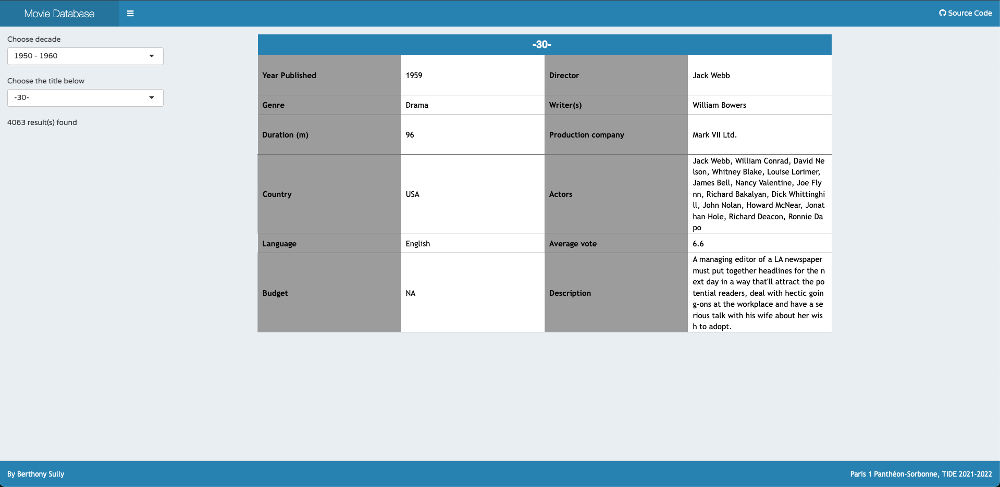

# Shiny-app-IMDB

This repository contains a small Shiny dashboard built during an R programming course. The application provides a lightweight interface to explore a subset of the IMDB movie database and is available in both English and French.

## Features

The app is divided into four main tabs:

1. **Movies Infos** – choose a decade and a title to display a formatted table with details on the selected movie.
2. **Data Table** – filter the dataset by language, country or genre and view the results in a searchable table.
3. **Hall of Fame** – display a podium of the three best rated movies for a given decade, year or genre.
4. **DataViz** – choose a decade to visualise the number of movies released per year with a bar chart.

A modal window describing the project appears when the app starts. All texts are provided in both English and French.

## Dataset

The application relies on `data_shiny_useable.csv`, a cleaned subset of the IMDB movie dataset. It includes common movie attributes such as title, year, genre, duration, country, language and average vote.

## Running the app locally

1. Make sure you have a recent version of **R** installed.
2. Install the packages listed in `Shiny_app/req_packages.R`.
3. From the repository root, launch the app with:
   ```R
   shiny::runApp("Shiny_app")
   ```

## Watch the demo - Click on the thumnail below ⬇️

[](https://drive.google.com/file/d/1kFCGabN0670mhC3NOUo9E1o0Ro1ozT-w/view)

A deployed version is available [here](https://htsull.shinyapps.io/Shiny_app).
